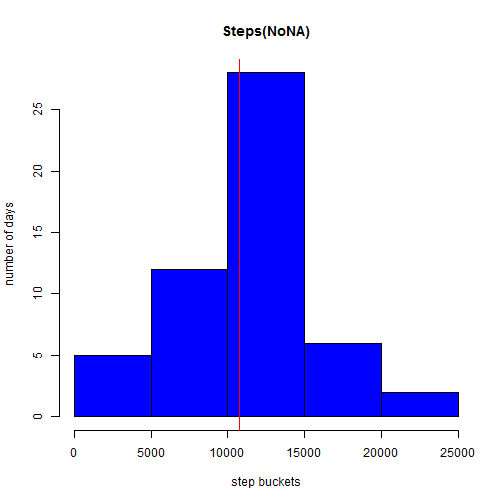
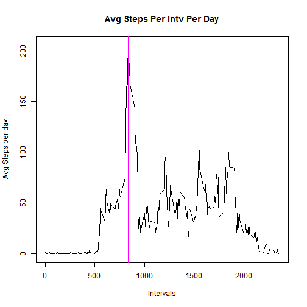
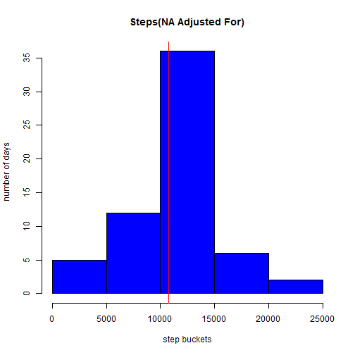
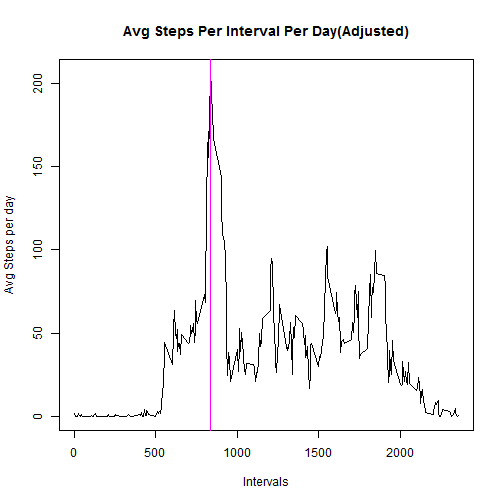
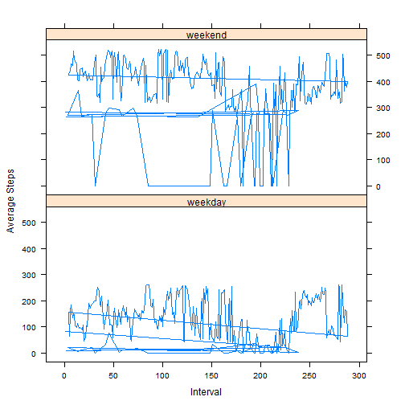

Reproducible Research Project 1 - Easton Bell
==========================================---
output: html_document
---
What is mean total number of steps taken per day?


```r
totalsstepsperday
```

```
## [1] 10766.19
```

```r
#############################################################################
```
Histogram of the total number of steps taken each day

Report the mean and median of the total number of steps taken per day

What is the average daily activity pattern?

Which 5-minute interval, on average across all the days in the dataset, contains the maximum number of steps?

 


```r
mean(hnoNA)
```

```
## [1] 10766.19
```

```r
median(hnoNA)
```

```
## [1] 10765
```


```r
maxintv$interval
```

```
## [1] 835
```
 
Total number of missing values in the dataset (i.e. the total number of rows with NAs)


number of rows with NA

```r
sum(isNA)
```

```
## [1] 2304
```
total number of rows

```r
nrow(basedata)
```

```
## [1] 17568
```

The interval mean value was used to fill in missing values
New total number of steps taken per day. 


Histogram of the total number of steps taken each day
Mean and median 

 

```r
mean(hs)
```

```
## [1] 10766.19
```

```r
median(hs)
```

```
## [1] 10766.19
```

These mean values are similar to the estimates in the first part of the assignment; The median values are now the same as well
The impact of imputing missing data on the estimates of the total daily number of steps was that mean and the median are now equal

Are there differences in activity patterns between weekdays and weekends?

Panel plot containing a time series plot of the 5-minute interval (x-axis) and the average number of steps taken, averaged across all weekday days or weekend days (y-axis). 


```
## [1] 835
```

  


